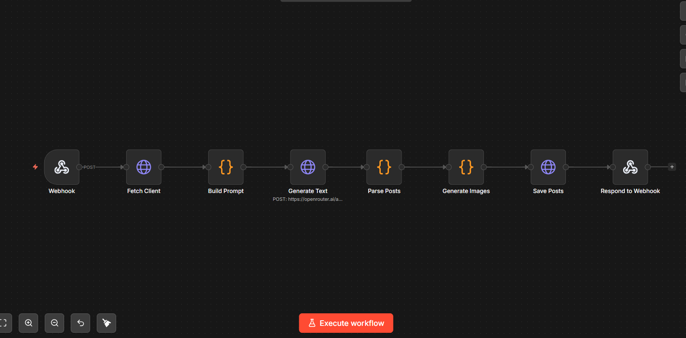

# Demo

Live screenshots and walkthrough of the AI Content Engine.

**Live URLs:**
- **Frontend** — https://frontend-theta-steel-79.vercel.app
- **Backend API** — https://ai-content-engine-api.fly.dev/health

---

## Screenshots

### All Clients View

The main dashboard — lists all client profiles in a card grid. Each card shows brand colors, services tags, monthly quota usage bar, and action links (Generate, Posts, Edit, Delete). The top stats bar shows total clients, active count, and post volume.

---

### Generated Posts View

Displays all AI-generated posts for a selected client. Each card shows the generated image, post hook, caption, call-to-action, hashtag pills, and content-type badge. Posts can be edited inline or published to social platforms.

---

### Edit Generated Posts

Inline editing mode on a PostCard — hook, caption, CTA, and hashtags can be tweaked before publishing. The image and content-type badge remain visible while editing.

---

### n8n Workflow Nodes

The n8n workflow node graph — Webhook → Fetch Client → Build Prompt → Generate Text → Parse Posts → Generate Images → Save Posts → Respond. Each node corresponds to a step in the `n8n/workflow.json` import.

---

## Video Walkthrough

### Add Client & AI Metrics

[`demo/add client and ai metrices.mp4`](demo/add%20client%20and%20ai%20metrices.mp4)

Walks through creating a new client profile with brand details, then shows the stats bar updating with AI performance metrics (generated posts, monthly usage, etc.).

> **Note:** GitHub does not render `.mp4` files inline in Markdown — the Git LFS icon appears instead. Download the file to view it, or upload to YouTube/Loom and replace the link.
